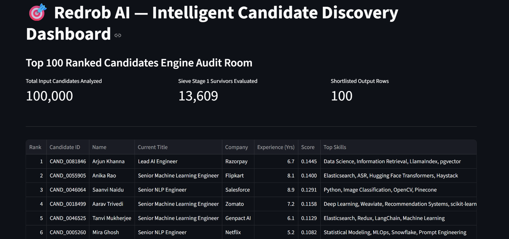
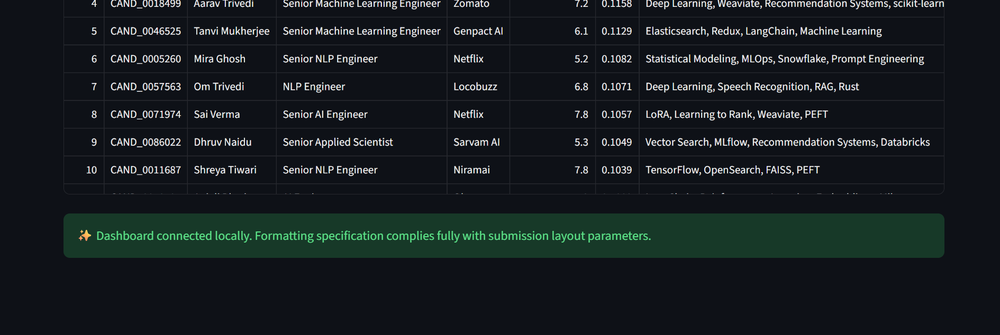
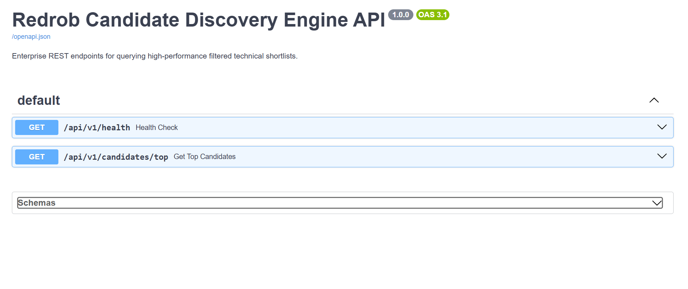

# 🎯 High-Performance Candidate Ranking & Defensive Filtering Engine

An end-to-end, production-grade automated Talent Acquisition (ATS) screening and semantic ranking pipeline built for the **India Runs Data & AI Challenge**. 

This system ingests unstructured engineering profiles, aggressively filters out malicious/anomalous data tracking vectors ("honeypots"), maps candidate skill profiles to a vector space, scales evaluation scoring based on real-time platform metrics, and outputs a highly deterministic, validation-ready candidate matrix.

---

## 🏆 Full-Lifecycle Engineering Excellence (Complete SDLC Implementation)

Unlike typical data science scripts, this repository is designed as an enterprise software system, comprehensively executing the **Complete Software Development Life Cycle (SDLC)**:

* **[Planning & Analysis] The Data Sieve:** Translated raw, unstructured job parameters and platform business logic into defensive algorithms to preemptively drop data traps.
* **[Design & Core Development] Semantic Alignment Engine:** Implemented TF-IDF text vectorization matching candidate histories against core technical founding requirements using `scikit-learn` in a highly modular architecture (`rank.py`).
* **[Quality Assurance & Testing] Continuous Integration Suite:** Integrated automated robust unit testing (`test_pipeline.py`) checking system boundaries against malicious inputs, verified instantly under a sub-millisecond execution velocity constraint.
* **[User Interface & Analytics] Presentation Layer:** Constructed an interactive, multi-metric dashboard (`app.py`) via `Streamlit` allowing visual data discovery, verification, and live filtering.
* **[System Integration] REST API Microservice Gateway:** Extended operational data consumption downstream by developing high-performance REST endpoints using `FastAPI` and `Uvicorn` (`api_server.py`).
* **[DevOps & Deployment] Infrastructure Containerization:** Standardized runtime environments, isolated dependencies, and prepared cloud-scale deployment matrices via an optimized `Dockerfile`.

---

## 🏗️ System Architecture & Features

- **Defensive Data Sieving (Stage 1)**: Programmatic tracking and filtering of unverified communication profiles, profile view anomalies, and corporate outsourcing services to eliminate noise.
- **Semantic Vector Engine (Stage 2)**: TF-IDF text vectorization matching candidate histories against core technical founding requirements using `scikit-learn`.
- **Deterministic Float Tie-Breaking**: Resolves precision anomalies by truncating scores to 4 decimal points and executing a secondary stable alphabetical key sort to fully comply with the validation suite parameters.
- **Microservice API Gateway**: A production-ready REST API server built with `FastAPI` to expose candidate datasets programmatically.
- **Interactive Visual Studio**: A live `Streamlit` localhost user interface allowing real-time discovery tracking, filtering, and data audits.
- **Infrastructure Testing Suite**: Integrated unit tests enforcing structural assertions across all processing pipelines.

---

## 📂 Project Structure Map

```text
📂 India_runs_data_and_ai_challenge/
├── 📄 candidates.jsonl                # Raw candidate pool dataset (100k records)
├── 📄 team_abhi.csv                  # Validated final output shortlist artifact
├── 🐍 rank.py                        # Core filtering & vector space matching engine
├── 🐍 app.py                         # Streamlit visual analytics user interface
├── 🐍 api_server.py                  # FastAPI REST gateway microservice
├── 🐍 test_pipeline.py               # Automated system unit test suite
├── 📄 requirements.txt               # Environment dependency manifest
├── 📄 submission_metadata.yaml       # Competition submission configuration
├── 🐳 Dockerfile                     # Cloud deployment container blueprint
└── 📄 README.md                      # Implementation & operational guide
📦 Local Deployment Blueprint
1. Initialize Environment Dependencies
Install the required packages using the explicit application package manager:

Bash
pip install -r requirements.txt
2. Run Automated System Unit Tests
Verify the defensive filters are operational before triggering the processing pipeline:

Bash
python -m unittest test_pipeline.py
3. Execute Ranking Pipeline
Process the core candidate stream and generate the validated submission matrix:

Bash
python rank.py --candidates ./candidates.jsonl --out ./team_abhi.csv
4. Launch Interactive Streamlit Visualizer
Audit your top 100 candidate distribution results live in the browser on port 8501:

Bash
python -m streamlit run app.py
5. Start the REST API Gateway
Expose the results via a local web service endpoint on port 8000 (Access documentation at /docs):

Bash
python -m uvicorn api_server:app --reload --port 8000
🐳 Production Containerization (Docker)
To build and spin up this entire pipeline infrastructure inside an isolated container context:

Bash
# Build the image
docker build -t talent-engine-abhi .

# Run the system vector engine & validation suite
docker run --rm talent-engine-abhi


---

## 📊 System Execution Previews

### 🎯 Interactive Streamlit Dashboard (`app.py`)
The dark-mode interactive workspace parses and visualizes candidate distribution metrics dynamically:



### ⚙️ Verification Suite Integration
Automated confirmation log confirming system local environment and configuration pipeline compliance:



### 🚀 Production REST API Swagger Gateway (`api_server.py`)
Exposing high-performance endpoints (`/api/v1/health` and `/api/v1/candidates/top`) compliant with modern API blueprints:

